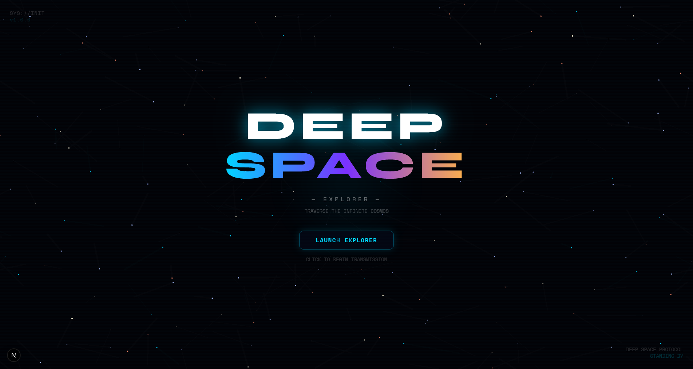
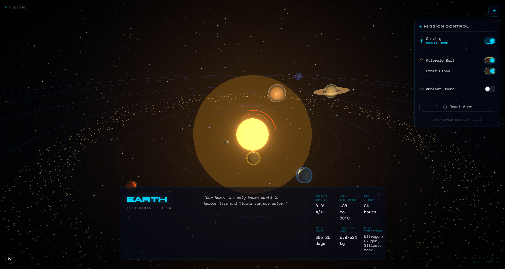
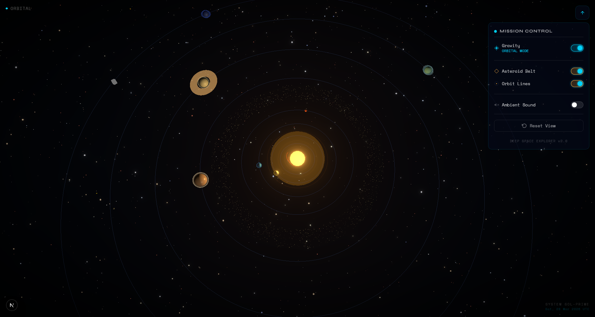
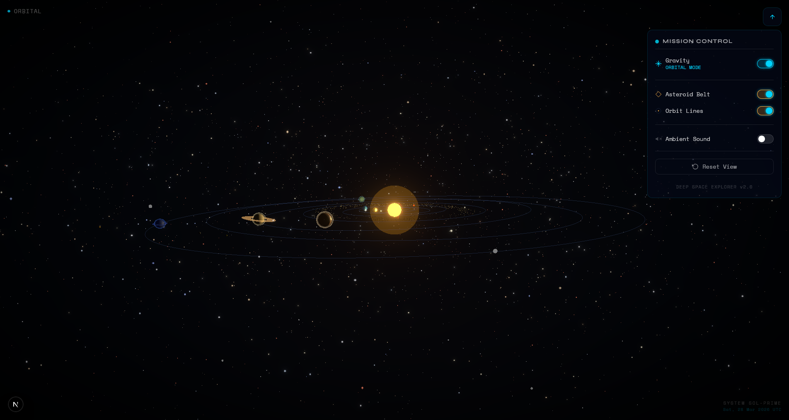
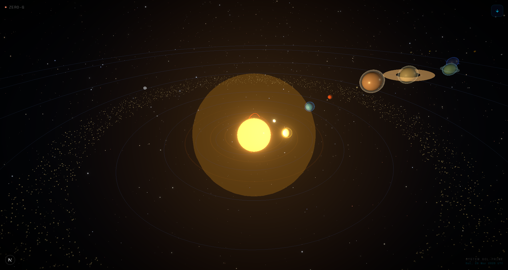

# 🌌 Deep Space Explorer

Deep Space Explorer is an immersive, high-performance 3D solar system simulation built with **Next.js**, **Three.js**, and **React Three Fiber**. It provides users with an interactive way to explore the wonders of our solar system, offering accurate celestial data, dynamic physics, and a premium cinematic UI.



## 🖼️ Gallery

|          **Celestial Data HUD**           |          **Solar System Overview**          |
| :---------------------------------------: | :-----------------------------------------: |
|  |  |

|         **Cinematic Perspective**         |            **Planetary Alignment**           |
| :---------------------------------------: | :------------------------------------------: |
|  |  |

## ✨ Key Features

-   **Interactive 3D Scene**: Explore a fully navigable 3D environment with smooth orbital controls and realistic lighting.
-   **Accurate Celestial Data**: Detailed statistics for all major planets, including gravity, temperature, mass, and orbital periods, based on real astronomical data.
-   **High-Performance Rendering**:
    -   **Asteroid Belt**: Utilizes instanced rendering to display thousands of asteroids efficiently.
    -   **Solar Flares**: dynamic, animated stellar phenomena.
    -   **Post-Processing**: Implements Bloom, Tone Mapping, and chromatic aberration for a cinematic aesthetic.
-   **Dynamic HUD & Control Panel**:
    -   Inspect specific planets and moons to view real-time data.
    -   Toggle physics like gravity systems and orbital paths.
    -   Customize visual fidelity, including bloom intensity and color temperature.
-   **Immersive Audio**: Ambient space soundscapes that react to user interaction and scene focus.
-   **Responsive Design**: A premium, "glassmorphic" UI built with Tailwind CSS that works across various screen sizes.

## 🚀 Tech Stack

-   **Framework**: [Next.js 16 (App Router)](https://nextjs.org/)
-   **3D Engine**: [Three.js](https://threejs.org/) with [React Three Fiber](https://r3f.docs.pmnd.rs/)
-   **3D Utilities**: [React Three Drei](https://github.com/pmndrs/drei) & [Postprocessing](https://github.com/pmndrs/postprocessing)
-   **State Management**: [Zustand](https://zustand-demo.pmnd.rs/)
-   **Styling**: [Tailwind CSS 4](https://tailwindcss.com/)
-   **Animations**: [Framer Motion](https://www.framer.com/motion/)
-   **Language**: [TypeScript](https://www.typescriptlang.org/)

## 🛠️ Getting Started

### Prerequisites

-   Node.js 18.x or later
-   npm, yarn, or pnpm

### Installation

1.  **Clone the repository**:
    ```bash
    git clone https://github.com/your-username/space-explorer.git
    cd space-explorer
    ```

2.  **Install dependencies**:
    ```bash
    npm install
    ```

3.  **Run the development server**:
    ```bash
    npm run dev
    ```

4.  **Open the app**:
    Navigate to [http://localhost:3000](http://localhost:3000) in your browser.

## 📂 Project Structure

```text
space-explorer/
├── app/                  # Next.js App Router (Pages and Layouts)
├── components/           # React Components
│   ├── SpaceCanvas.tsx   # Main 3D Scene Container
│   ├── AsteroidBelt.tsx  # Instanced Asteroid rendering
│   ├── HUD.tsx           # Heads-up display UI
│   ├── ControlPanel.tsx  # Settings and customization UI
│   └── ...               # Additional celestial components
├── hooks/                # Custom React Hooks (e.g., useAudioAmbience)
├── lib/                  # Utility functions and celestial data
├── store/                # Zustand State Stores
├── public/               # Static assets (Textures, Audio)
└── ...config files       # TSConfig, Tailwind, Next.js config
```

## 🎨 Design Philosophy

Deep Space Explorer was designed with a focus on **visual excellence** and **user engagement**. The UI uses a dark, minimalist aesthetic with glassmorphism effects to ensure players feel truly immersed in space. Every interaction, from selecting a planet to toggling the HUD, is accompanied by subtle micro-animations using Framer Motion.

## 📜 License

This project is licensed under the MIT License. See the [LICENSE](LICENSE) file for details.

---

*Made with ❤️ for space enthusiasts and web developers alike.*
