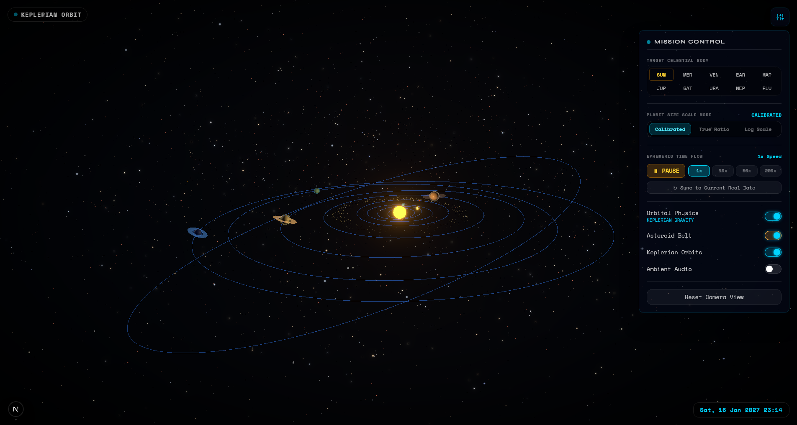

# 🌌 Deep Space Explorer

Deep Space Explorer is an immersive, high-performance interactive 3D solar system simulation built with **Next.js 16**, **Three.js**, and **React Three Fiber**. It provides users with a cinematic interface to explore our solar system, offering accurate astronomical telemetry, real-time ephemeris orbital controls, dynamic physics simulation, and atmospheric visual effects.


---

## 🖼️ Gallery & Visualization Modes

| **Celestial Telemetry HUD** | **Heliocentric System View** |
| :-------------------------: | :--------------------------: |
|  |  |

| **True Scale & Calibrated Ratios** | **Planetary Alignment Perspective** |
| :--------------------------------: | :---------------------------------: |
|  |  |

---

## ✨ Key Features

- 🪐 **Interactive 3D Solar System**:
  - OrbitControls camera navigation with target tracking and focus on any celestial body.
  - Custom planet shaders, atmospheric halo effects, and dynamic solar flare coronal emissions.
- 📊 **Accurate Astronomical Telemetry & Data**:
  - Comprehensive physical stats for all major planets (Radius, Mass, Surface Gravity, Density, Escape Velocity, Axial Tilt).
  - Atmospheric gas breakdown percentages and thermal ranges.
  - Historical space exploration mission records (NASA, ESA, JAXA) and major natural satellites (moons).
- 📐 **Multiple Scaling & Orbital Modes**:
  - **Calibrated Scale Mode**: Visually optimized scaling for smooth intuitive exploration.
  - **True Scale Mode**: Proportional planetary and orbital distance ratios.
  - **Keplerian Orbit vs. Zero-G Drift**: Toggle physics engine between Keplerian orbital mechanics and zero-gravity space drift.
- ⏱️ **Real-Time Ephemeris & Time Controls**:
  - Real-time simulation clock synced with planetary orbital velocities.
  - Customizable time acceleration speeds (1x to 500x) and date reset controls.
- ⚡ **High-Performance 3D Graphics**:
  - **Instanced Asteroid Belt**: Renders thousands of asteroid particles efficiently with instanced mesh buffers.
  - **Cinematic Post-Processing**: Bloom intensity controls, tone mapping, and visual color temperature adjustments.
  - **Dynamic Starfield & Space Dust**: Multi-layered background particle systems creating depth.
- 🎵 **Audio Ambience & Glassmorphic UI**:
  - Web Audio API synthesizer generating real-time ambient soundscapes.
  - Glassmorphic UI built with Tailwind CSS v4 and Framer Motion micro-animations.

---

## 🚀 Tech Stack

- **Framework**: [Next.js 16 (App Router)](https://nextjs.org/)
- **3D Engine**: [Three.js](https://threejs.org/) & [React Three Fiber](https://r3f.docs.pmnd.rs/)
- **3D Utilities**: [React Three Drei](https://github.com/pmndrs/drei) & [Postprocessing](https://github.com/pmndrs/postprocessing)
- **State Management**: [Zustand 5](https://zustand-demo.pmnd.rs/)
- **Styling**: [Tailwind CSS 4](https://tailwindcss.com/)
- **Animations**: [Framer Motion 12](https://www.framer.com/motion/)
- **Language**: [TypeScript](https://www.typescriptlang.org/)

---

## 🛠️ Getting Started

### Prerequisites

- Node.js 18.x or higher
- npm, yarn, or pnpm

### Installation & Execution

1. **Clone the repository**:
   ```bash
   git clone https://github.com/JainamKhara/space-explorer.git
   cd space-explorer
   ```

2. **Install dependencies**:
   ```bash
   npm install
   ```

3. **Launch development server**:
   ```bash
   npm run dev
   ```

4. **Open in browser**:
   Navigate to [http://localhost:3000](http://localhost:3000).

---

## 📂 Project Structure

```text
space-explorer/
├── app/                  # Next.js App Router (Pages, Layouts & Entry Screen)
├── components/           # 3D Scene Components & UI Elements
│   ├── SpaceCanvas.tsx   # Core 3D Canvas, Lighting & Post-Processing
│   ├── Planets.tsx       # Render engine for planets, rings & moons
│   ├── AsteroidBelt.tsx  # Instanced mesh rendering for asteroids
│   ├── SolarFlares.tsx   # Animated Sun corona shaders
│   ├── GravitySystem.tsx # Orbital mechanics & zero-G physics
│   ├── StarField.tsx     # Deep space particle starfield
│   ├── SpaceDust.tsx     # Ambient space dust particles
│   ├── ShootingStar.tsx  # Procedural shooting star streaks
│   ├── ErrorBoundary.tsx # WebGL error handling wrapper
│   ├── HUD.tsx           # Telemetry console & object inspector
│   └── ControlPanel.tsx  # Simulation controls, physics & time options
├── hooks/                # Custom React Hooks (Audio synthesizer)
├── lib/                  # Celestial body dataset & custom GLSL shaders
├── store/                # Zustand global state manager (useSpaceStore)
├── public/               # Static assets & textures
└── screenshots/          # Documentation gallery images
```

---

## 🎨 Design Philosophy

Deep Space Explorer combines **scientific accuracy** with a **premium futuristic interface**. Designed with deep space dark modes, translucent glassmorphism UI containers, glowing cyan telemetry gauges, and responsive spring-driven UI transitions, the application delivers an engaging visual experience across all screen sizes.

---

## 📜 License

This project is open-source and available under the [MIT License](LICENSE).

---

*Designed & built with ❤️ for space enthusiasts and web developers.*
